<div align="center">

<h1>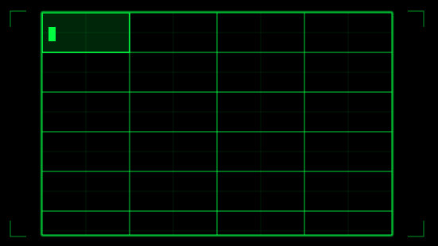 &nbsp;tuiX</h1>

[](https://github.com/paolopangrazi/tuix/actions/workflows/ci.yml)
[](LICENSE)
[](https://en.cppreference.com/w/cpp/17)
[](https://github.com/ArthurSonzogni/FTXUI)

### *the spreadsheet that lives in your terminal, and feels instant.*

*Open a CSV or XLSX. Fly through it with vim keys. Write formulas. Undo anything.*
*Never touch the mouse — unless you want to.*
*Built in [Omarchy](https://omarchy.org). Built for Omarchy ([see gallery](#omarchy-theme-gallery)) and any compatible Linux distro.*

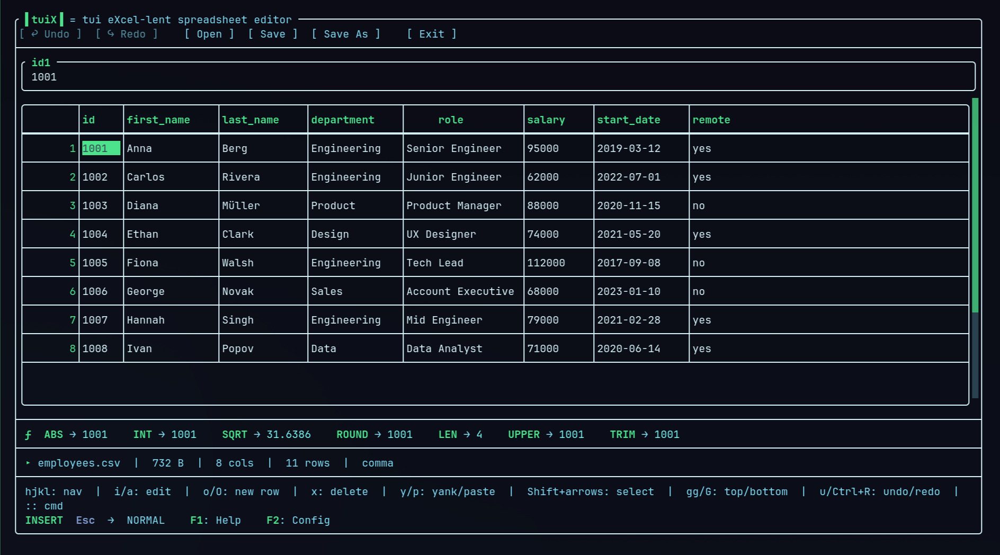

</div>

---

**[Why tuiX?](#why-tuix) · [What you can do](#what-you-can-actually-do) · [Omarchy themes](#omarchy-theme-gallery) · [Install & build](#install--build) · [Key bindings](#key-bindings) · [Configuration](#configuration) · [License](#license)**

---

## Why tuiX?

Opening a CSV shouldn't mean waiting on a 300 MB Electron app to boot, or fighting a web grid that lags one keystroke behind your fingers. tuiX is a **native C++ binary** built on [FTXUI](https://github.com/ArthurSonzogni/FTXUI). It launches in the time it takes your terminal to draw a frame, and **every single keystroke lands immediately** — no spinners, no debounce, no "syncing…", no flicker.

- 🚀 **Blazingly fast — always.** A single native binary with a cold start measured in milliseconds. Files are on screen before you finish blinking. Every action — navigation, editing, undo, formula evaluation — is **instantaneous**.
- ⌨️ **Zero-latency editing.** Type, navigate, undo — the grid redraws on every event with no perceptible delay, ever. Your terminal *is* the UI; there is nothing heavier between you and your data.
- 💡 **Immediate feedback everywhere.** Formula suggestions appear the instant you land on a cell. Range statistics update live on every keypress as you extend a selection. You never wait for tuiX.
- 🪶 **Featherweight.** No runtime dependencies, no Node, no browser engine, no background daemon. Just a binary and your file.
- 🎨 **Theme-native.** tuiX paints itself from your terminal's ANSI palette, so it adopts your [Omarchy](https://omarchy.org) theme automatically — switch themes, and tuiX follows. (More below.)
- 🧠 **vim muscle memory.** `h j k l`, `gg`, `G`, `0`, `$`, modes, `:w`, `:q` — if your fingers know vim, they already know tuiX.

If you live in the terminal, tuiX is the spreadsheet that finally feels like it belongs there.

---

## What you can actually do

### 📂 Open and move through data — instantly
Point tuiX at a **CSV or XLSX file** and it's on screen **before you blink**. Glide around with `h j k l` or arrow keys, jump to the top/bottom with `gg` / `G`, snap to the first/last column with `0` / `$`, and page through big files with `PgUp` / `PgDn`. CSV delimiters (comma, semicolon, tab, pipe) are auto-detected — no configuration, no delay. XLSX files load the first worksheet automatically.

### ✏️ Edit like you mean it — with zero friction
Press `i` or `a` to start typing into a cell. The response is **immediate**: no input lag, no waiting for the cursor to appear. tuiX has a **sticky INSERT mode** — like a real spreadsheet, you can keep typing and arrowing from cell to cell without dropping back to navigation. `Enter` commits and moves down, `Tab` commits and moves right. `Esc` drops you back to NORMAL. Column **headers behave exactly like cells** — edit them the same way, with the same undo.

### ↩️ Undo & redo — instantly
Every edit — cell values *and* column renames — is on a single undo stack. `u` to undo, `Ctrl+R` to redo, and the grid snaps back **immediately**. Experiment freely; you can always walk it back.

### 🧮 Real formulas — evaluated on the spot
Start any cell with `=` and tuiX evaluates it **live, right away**. A full lexer → parser → evaluator pipeline backs **18 functions**, cell references, and ranges:

```
=A1 + B2 * 3                 arithmetic & precedence
=SUM(A1:A10)                 ranges
=IF(C2 > 100, "hi", "lo")    conditionals
=IFERROR(A1 / B1, 0)         error handling
=ROUND(AVERAGE(B1:B5), 2)    nesting
```

> **Functions:** `ABS` · `AVERAGE` · `CONCATENATE` · `COUNT` · `COUNTA` · `IF` · `IFERROR` · `INT` · `LEN` · `LOWER` · `MAX` · `MIN` · `MOD` · `ROUND` · `SQRT` · `SUM` · `TRIM` · `UPPER`

Type `=` and a name, and an **autocomplete popup** appears **instantly** with signatures and descriptions — `↑`/`↓` to browse, `Tab`/`Enter` to complete. Circular references are detected and flagged instead of hanging.

### 💡 Smart formula suggestions — always ready, always instant

Land on a cell and a **suggestion bar** appears below the grid **immediately**, showing you what the most useful formulas would produce *right now*, without you having to type anything:

- On a **number** → `ABS` · `INT` · `SQRT` · `ROUND` · `LEN` · `UPPER` · `TRIM`
- On a **text cell** → `LEN` · `UPPER` · `LOWER` · `TRIM`

Select **multiple cells** with `Shift`+arrows and the bar switches to **live range statistics** — `SUM`, `AVG`, `COUNT`, `COUNTA`, `MIN`, `MAX` — **recalculated on every single keystroke** as your selection grows or shrinks. No configuration, no extra step, no delay: select cells, see the numbers.

### 📐 Reshape your sheet — immediately
Insert and delete **rows and columns** on the fly with `+` / `-` (in the row-index gutter for rows, in the header for columns) — the grid reflows **instantly**. Select a region with `Shift`+arrows, **yank** it with `y`, and **paste** it elsewhere with `p`.

### 🖱️ Mouse, if you want it
Don't feel like reaching for the keyboard? Click any cell to select it — **it responds immediately**. Click the little `+`/`-` action boxes on rows and columns to insert/delete. Drag the scrollbar or spin the wheel to scroll. tuiX is keyboard-first, not keyboard-only.

### 💾 Save without leaving home row
`:w` saves, `:w newname.csv` saves as, `:wq` saves and quits, `:e other.csv` opens another file — all from the command line, vim-style, **with instant execution**. The format follows the extension: `:w report.xlsx` writes a proper Excel file, `:w export.csv` writes CSV. There's a titlebar with **Undo / Redo / Open / Save / Save As / Exit** buttons too, and an overwrite-confirmation prompt so you never clobber a file by accident.

### 🆘 Help & live config, built in
Hit `F1` for a tabbed keybinding reference, and `F2` for a **live configuration editor** that writes your changes straight to `config.toml` — changes take effect the next time you launch.

---

## 🎨 Made for Omarchy (and any themed terminal)

tuiX never hardcodes RGB values. Every color it draws — cursor, selection, headers, mode badges, formulas — is a reference to one of your terminal's **16 ANSI palette slots** (or a named color / index `0–15`).

That means tuiX **inherits your terminal theme for free**. On [Omarchy](https://omarchy.org), when you switch your selected theme, your terminal's palette changes — and tuiX instantly wears the same colors as the rest of your desktop. No tuiX-specific theme files to maintain, no mismatch between your editor and your spreadsheet. It just blends in, perfectly, with whatever you're running.

Want to override a specific accent anyway? You can — see [Configuration](#configuration).

---

## Omarchy Theme Gallery

tuiX on all 20 built-in Omarchy themes — same app, your palette.

<div style="overflow-x: auto; scroll-snap-type: x mandatory; -webkit-overflow-scrolling: touch; display: flex; gap: 10px; padding: 10px 0;">
  <div style="scroll-snap-align: center; flex: 0 0 100%; text-align: center;">
    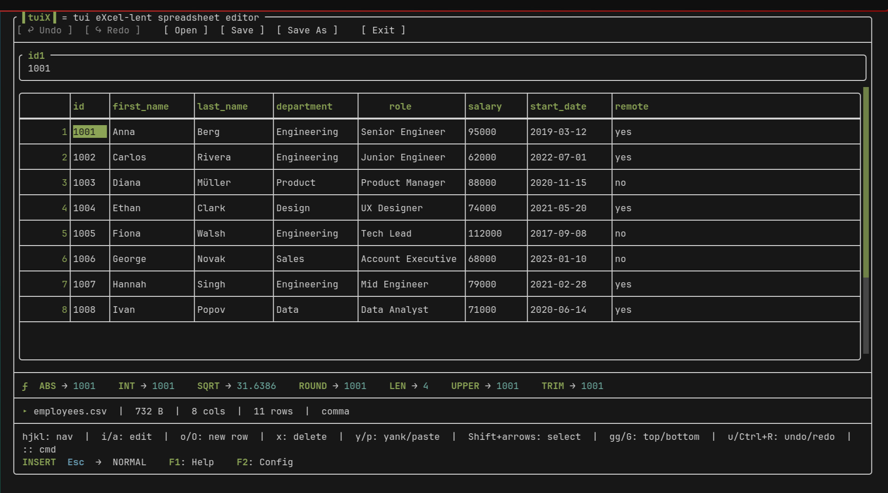
    <p><strong>Aether</strong> &nbsp;·&nbsp; 1 / 20</p>
  </div>
  <div style="scroll-snap-align: center; flex: 0 0 100%; text-align: center;">
    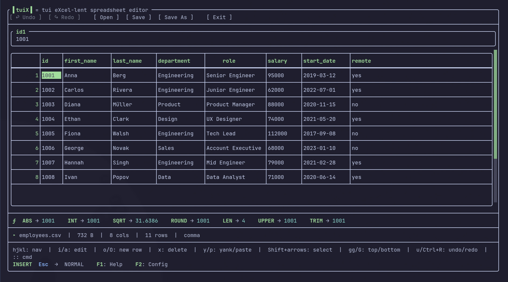
    <p><strong>Catppuccin</strong> &nbsp;·&nbsp; 2 / 20</p>
  </div>
  <div style="scroll-snap-align: center; flex: 0 0 100%; text-align: center;">
    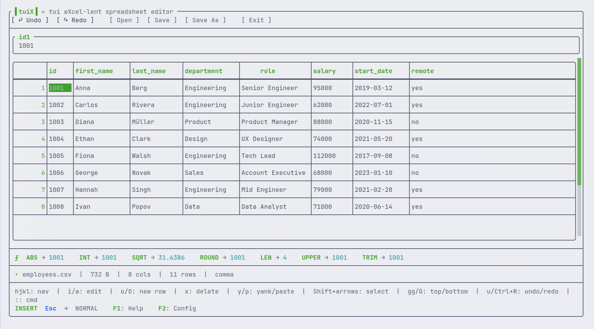
    <p><strong>Catppuccin Latte</strong> &nbsp;·&nbsp; 3 / 20</p>
  </div>
  <div style="scroll-snap-align: center; flex: 0 0 100%; text-align: center;">
    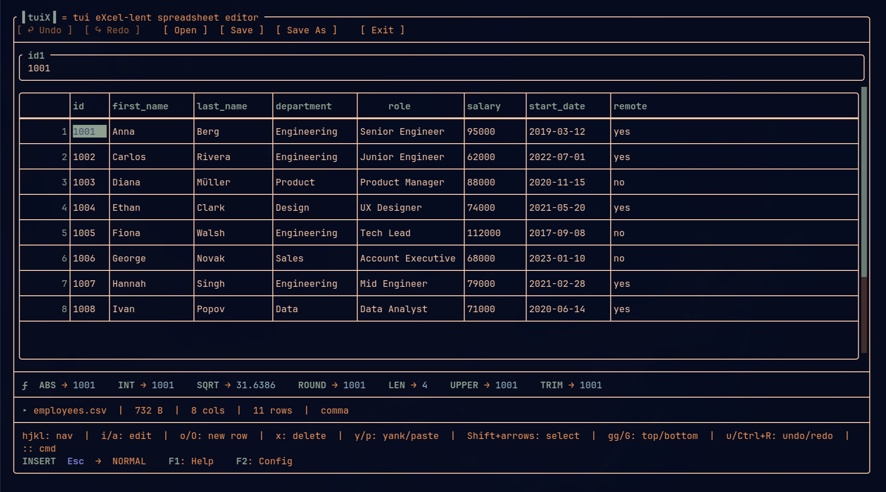
    <p><strong>Ethereal</strong> &nbsp;·&nbsp; 4 / 20</p>
  </div>
  <div style="scroll-snap-align: center; flex: 0 0 100%; text-align: center;">
    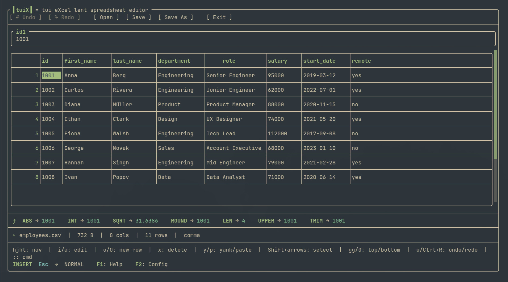
    <p><strong>Everforest</strong> &nbsp;·&nbsp; 5 / 20</p>
  </div>
  <div style="scroll-snap-align: center; flex: 0 0 100%; text-align: center;">
    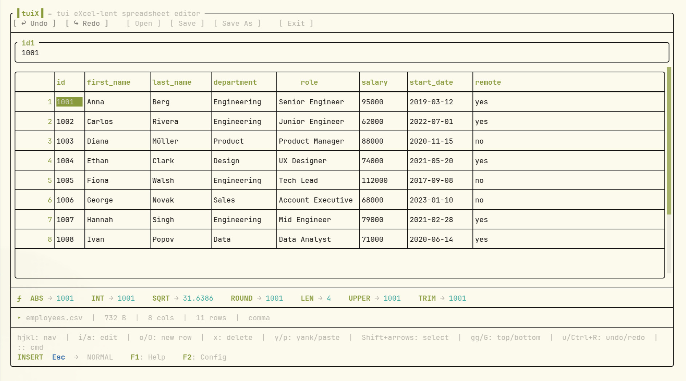
    <p><strong>Flexoki Light</strong> &nbsp;·&nbsp; 6 / 20</p>
  </div>
  <div style="scroll-snap-align: center; flex: 0 0 100%; text-align: center;">
    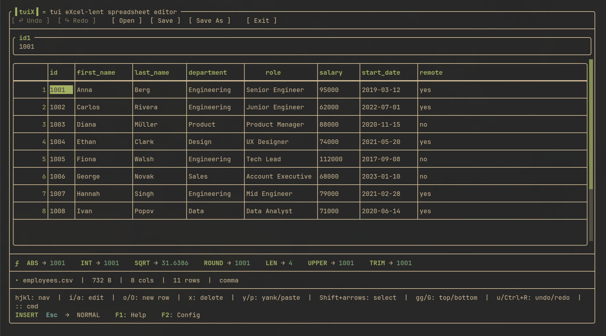
    <p><strong>Gruvbox</strong> &nbsp;·&nbsp; 7 / 20</p>
  </div>
  <div style="scroll-snap-align: center; flex: 0 0 100%; text-align: center;">
    
    <p><strong>Hackerman</strong> &nbsp;·&nbsp; 8 / 20</p>
  </div>
  <div style="scroll-snap-align: center; flex: 0 0 100%; text-align: center;">
    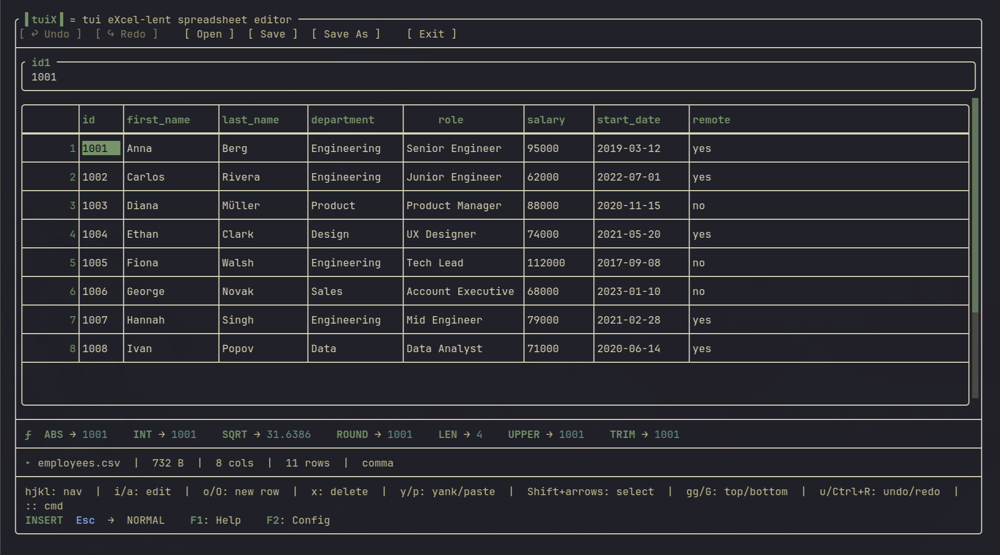
    <p><strong>Kanagawa</strong> &nbsp;·&nbsp; 9 / 20</p>
  </div>
  <div style="scroll-snap-align: center; flex: 0 0 100%; text-align: center;">
    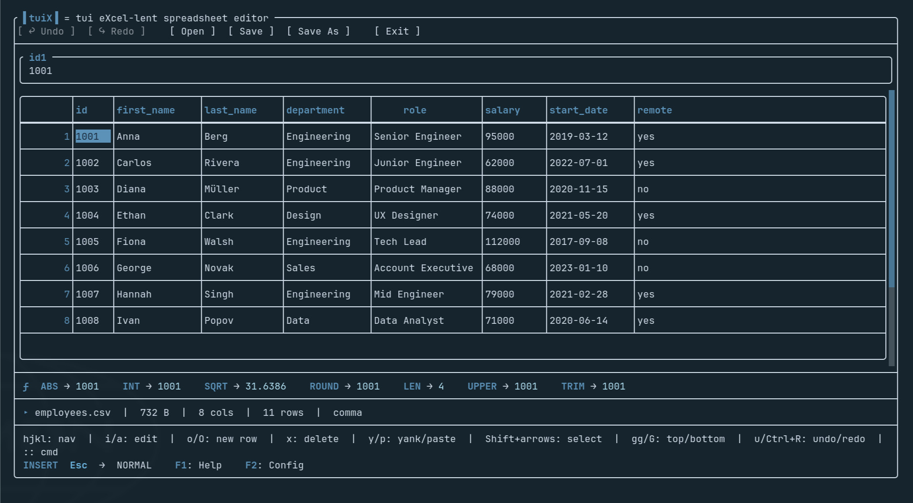
    <p><strong>Lumon</strong> &nbsp;·&nbsp; 10 / 20</p>
  </div>
  <div style="scroll-snap-align: center; flex: 0 0 100%; text-align: center;">
    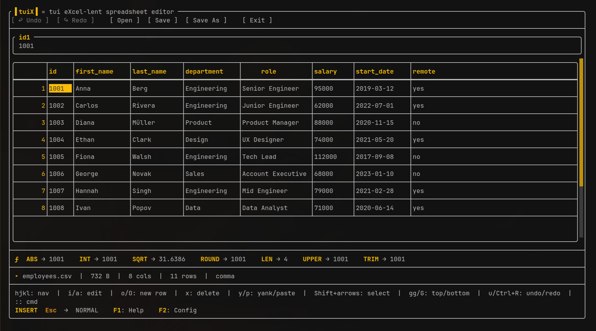
    <p><strong>Matte Black</strong> &nbsp;·&nbsp; 11 / 20</p>
  </div>
  <div style="scroll-snap-align: center; flex: 0 0 100%; text-align: center;">
    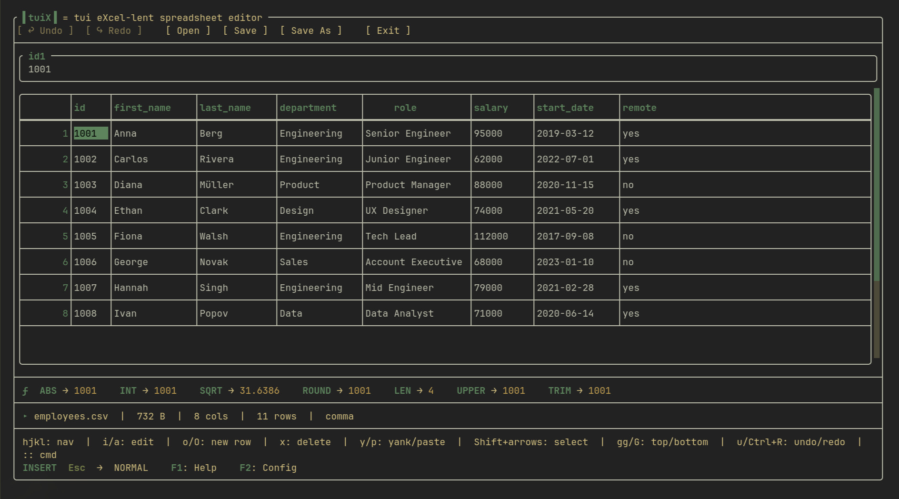
    <p><strong>Miasma</strong> &nbsp;·&nbsp; 12 / 20</p>
  </div>
  <div style="scroll-snap-align: center; flex: 0 0 100%; text-align: center;">
    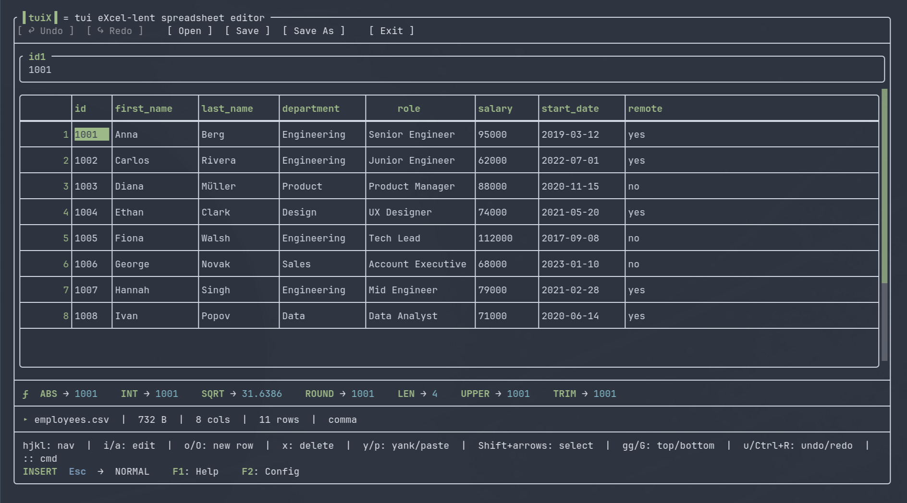
    <p><strong>Nord</strong> &nbsp;·&nbsp; 13 / 20</p>
  </div>
  <div style="scroll-snap-align: center; flex: 0 0 100%; text-align: center;">
    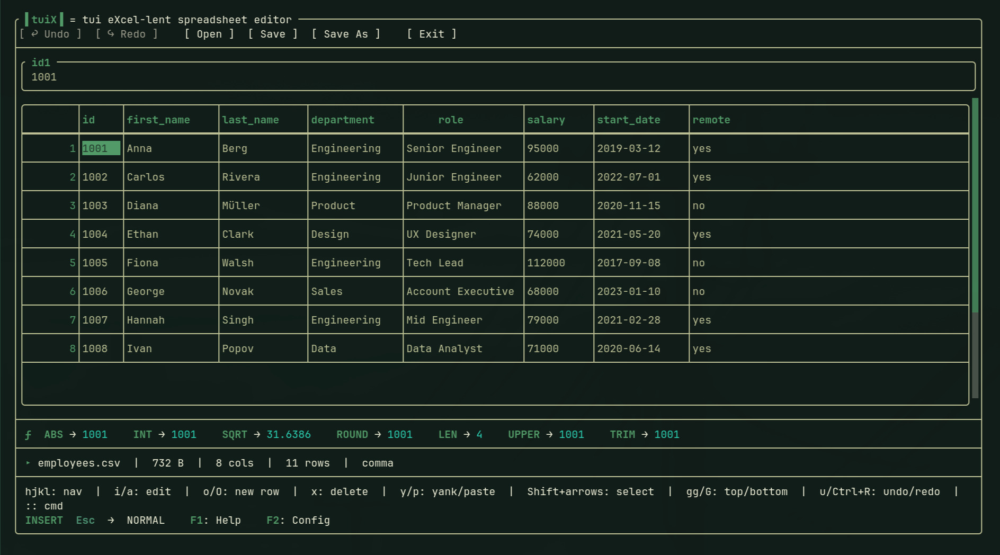
    <p><strong>Osaka Jade</strong> &nbsp;·&nbsp; 14 / 20</p>
  </div>
  <div style="scroll-snap-align: center; flex: 0 0 100%; text-align: center;">
    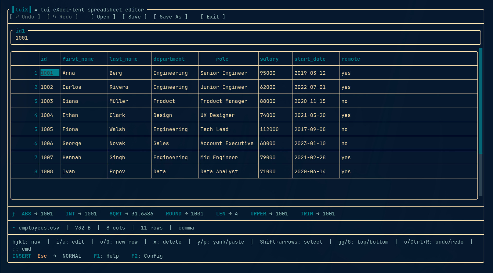
    <p><strong>Retro 82</strong> &nbsp;·&nbsp; 15 / 20</p>
  </div>
  <div style="scroll-snap-align: center; flex: 0 0 100%; text-align: center;">
    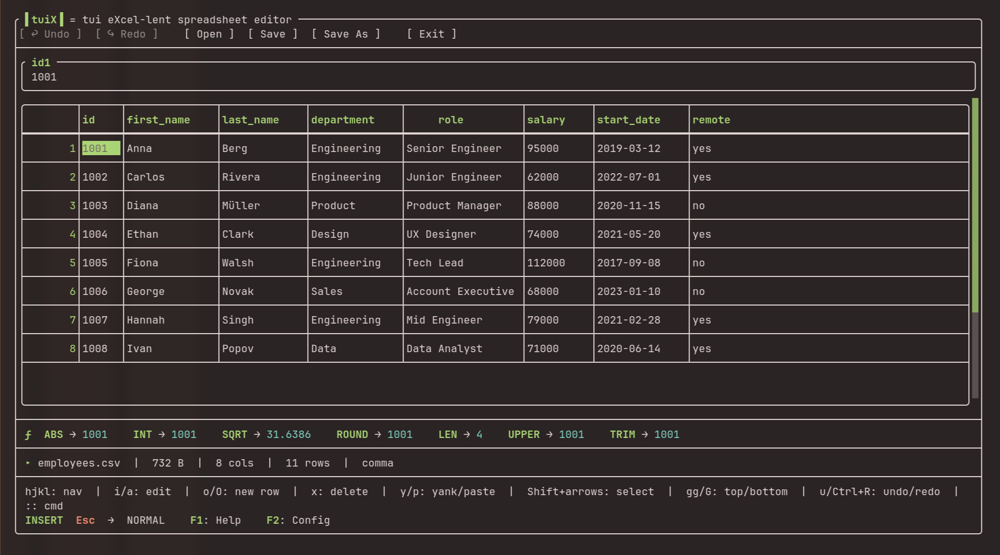
    <p><strong>Ristretto</strong> &nbsp;·&nbsp; 16 / 20</p>
  </div>
  <div style="scroll-snap-align: center; flex: 0 0 100%; text-align: center;">
    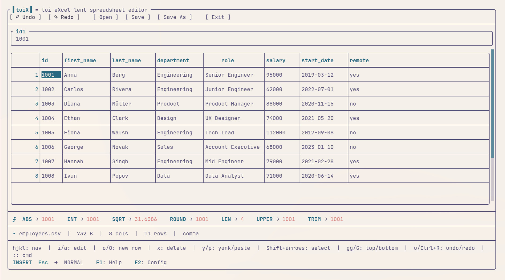
    <p><strong>Rose Pine</strong> &nbsp;·&nbsp; 17 / 20</p>
  </div>
  <div style="scroll-snap-align: center; flex: 0 0 100%; text-align: center;">
    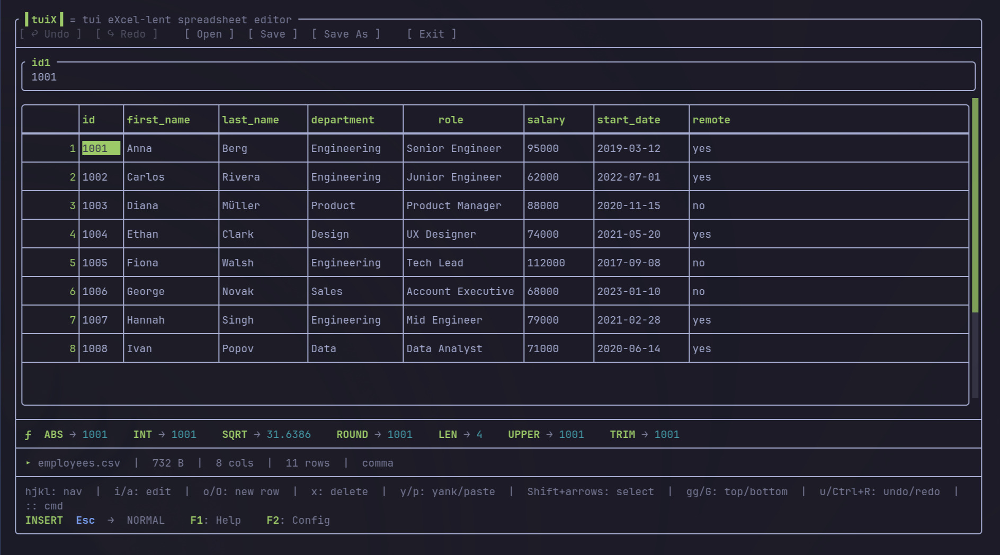
    <p><strong>Tokyo Night</strong> &nbsp;·&nbsp; 18 / 20</p>
  </div>
  <div style="scroll-snap-align: center; flex: 0 0 100%; text-align: center;">
    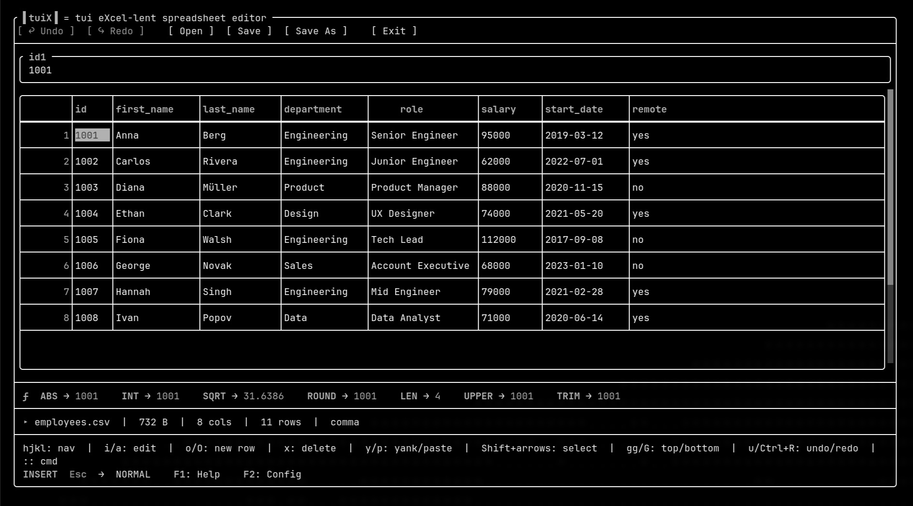
    <p><strong>Vantablack</strong> &nbsp;·&nbsp; 19 / 20</p>
  </div>
  <div style="scroll-snap-align: center; flex: 0 0 100%; text-align: center;">
    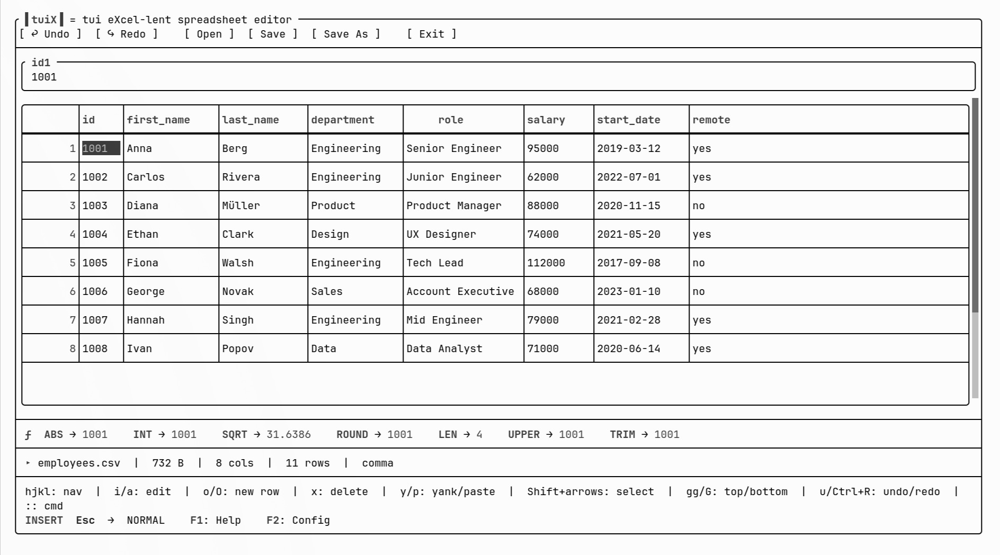
    <p><strong>White</strong> &nbsp;·&nbsp; 20 / 20</p>
  </div>
</div>

---

## Install & build

> **Platform support:** Linux is the primary target and fully tested. macOS and Windows support is **in progress** — the code is portable in principle but has not been built or tested on those platforms yet.

**Requirements:** CMake 3.14+, a C++17 compiler (GCC 8+ / Clang 7+), and Git. Every dependency — [FTXUI](https://github.com/ArthurSonzogni/FTXUI), [rapidcsv](https://github.com/d99kris/rapidcsv), [toml++](https://github.com/marzer/tomlplusplus), and [OpenXLSX](https://github.com/troldal/OpenXLSX) — is vendored as a git submodule. **No system packages required.**

```bash
git clone --recurse-submodules https://github.com/paolopangrazi/tuix
cd tuix
cmake -B build
cmake --build build
./build/tuix samples/csv/employees.csv   # try it out
```

> Already cloned without submodules? Run `git submodule update --init --recursive` first.

Install it onto your `PATH`:

```bash
cmake --install build --prefix ~/.local   # → ~/.local/bin/tuix
```

```bash
tuix                        # start with a blank sheet
tuix path/to/file.csv       # open a CSV
tuix path/to/file.xlsx      # open an Excel file
```

---

## Key bindings

### Navigate (NORMAL mode)

| Key | Action |
|---|---|
| `h` `j` `k` `l` / arrows | Move left / down / up / right |
| `gg` / `G` | Jump to first / last row |
| `0` `Home` / `$` `End` | Jump to first / last column |
| `PgUp` / `PgDn` | Scroll one page |
| `↑` from row 0 | Enter the column header |

### Edit

| Key | Action |
|---|---|
| `i` / `a` | Edit cell · rename column header (→ INSERT) |
| `Esc` | Back to NORMAL |
| `o` / `O` | Insert row below / above and edit |
| `Enter` | Commit & move down |
| `Tab` / `Shift+Tab` | Commit & move right / left |
| `x` / `Backspace` | Clear cell · delete row (gutter) · delete column (header) |

### Select, clipboard & structure

| Key | Action |
|---|---|
| `Shift`+arrows | Select a range |
| `y` / `p` | Yank / paste |
| `+` / `-` | Insert / delete row (gutter) or column (header) |

### Formulas, history & app

| Key | Action |
|---|---|
| `=` | Start a formula (opens autocomplete) |
| `↑`/`↓`, `Tab`/`Enter` | Browse / complete a formula |
| `u` / `Ctrl+R` | Undo / redo |
| `:` | Command mode — `:w`, `:w file`, `:wq`, `:q`, `:q!`, `:e file` |
| `F1` / `F2` | Help · live config editor |
| `Ctrl+E` | Toggle exit confirmation |

---

## Configuration

tuiX reads `~/.config/tuix/config.toml` at startup (XDG-compliant — respects `$XDG_CONFIG_HOME`). Every setting is optional; missing keys fall back to sensible defaults. Colors accept an **ANSI name** or a **palette index `0–15`**, which is exactly what lets tuiX track your terminal theme.

```toml
[colors]
# ANSI name (black, red, green, yellow, blue, magenta, cyan, white,
# gray_dark, gray_light, *_light variants) — or a palette index 0–15
cursor_bg       = "green"
cursor_fg       = "black"
selection_bg    = "blue"
selection_fg    = "white"
header          = "green"
row_number      = "green"
dimmed          = "gray_light"
insert_badge_bg = "green"
insert_badge_fg = "black"
normal_badge_bg = "blue"
normal_badge_fg = "white"
titlebar_bg     = "green"
titlebar_fg     = "black"
formula_fg      = "cyan"

[keys]
# each binding is a list of single-character strings
nav_up      = ["k"]
nav_down    = ["j"]
nav_left    = ["h"]
nav_right   = ["l"]
insert_mode = ["i", "a"]
delete_cell = ["x"]
undo        = ["u"]
insert_row  = ["+"]
delete_row  = ["-"]
insert_col  = ["+"]
delete_col  = ["-"]
rename_col  = ["i", "a"]
cmd_mode    = [":"]

[grid]
cell_width = 12   # minimum column width (min 4)
```

> 💡 Tip: leave the colors as palette names and let your Omarchy theme drive them. Only pin a value here if you want tuiX to deviate from your terminal's palette.

---

## License

MIT — see [LICENSE](LICENSE).

<div align="center">

**Built for people who never leave the terminal.**

</div>
