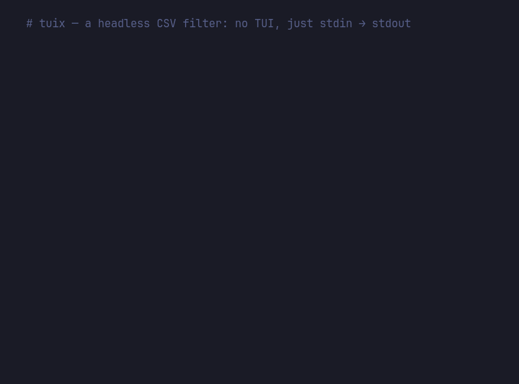

<div align="center">


<h1>tuiX</h1>

**tui eXcel-lent — a fast, keyboard-driven spreadsheet editor for the terminal.**

[](https://github.com/paolopangrazi/tuix/actions/workflows/ci.yml)
[](LICENSE)
[](https://en.cppreference.com/w/cpp/17)
[](https://github.com/ArthurSonzogni/FTXUI)

Open a CSV or XLSX file, move through it with vim keys, evaluate formulas, and save —
without leaving your terminal. tuiX is a single native C++ binary built on
[FTXUI](https://github.com/ArthurSonzogni/FTXUI), with no runtime dependencies.


### Platform support

| Platform | Architecture | Prebuilt binary | Requirements |
|---|---|---|---|
| Linux | x86_64 | `linux-x86_64.tar.gz` | glibc 2.35+ (Ubuntu 22.04, Debian 12, RHEL 9) |
| Linux | arm64 / aarch64 | `linux-arm64.tar.gz` | glibc 2.35+ — Raspberry Pi, Ampere, Asahi |
| macOS | Apple Silicon | `macos-universal.tar.gz` | universal binary |
| macOS | Intel (x86_64) | `macos-universal.tar.gz` | same archive as Apple Silicon |
| Windows | x86_64 | `windows-x86_64.zip` | self-contained `.exe`, no VC++ redistributable |
| Windows | arm64 | — | [build from source](#build-from-source) |
| BSD / other | any | — | [build from source](#build-from-source) |

Archives are named `tuix-<version>-<target>`. Each prebuilt binary is compiled and
test-run in CI on the platform it targets. The C++ runtime is linked statically, so
the binaries carry no dependencies beyond the system libc.

**[Overview](#overview) · [Usage](#usage) · [Headless mode](#headless-mode) · [Features](#features) · [Theming](#theming) · [Gallery](#theme-gallery) · [Installation](#installation) · [Key bindings](#key-bindings) · [Configuration](#configuration) · [License](#license)**

</div>

---

## Overview

tuiX is a terminal spreadsheet editor written in C++17. It opens CSV and XLSX files
as a single native binary — no browser engine, no Node runtime, no background daemon.
Navigation and editing follow vim conventions, and a built-in formula engine evaluates
expressions on the fly.

It is developed on and for [Omarchy](https://omarchy.org) ([see gallery](#theme-gallery))
and works on any compatible Linux distribution. Prebuilt binaries are available for
Linux (x86_64 and arm64), macOS (Apple Silicon and Intel) and Windows — see
[platform support](#platform-support).

**Highlights**

- **Native and lightweight** — a single binary with a sub-second cold start and no runtime dependencies.
- **vim-style editing** — `h j k l`, `gg`, `G`, `0`, `$`, `/` search, modal editing, and `:` commands.
- **Formula engine** — 27 functions, cell references, and ranges, evaluated live.
- **Multi-sheet** — XLSX workbooks open with a tab per worksheet; cycle, add, rename, and delete them, and reference across them with `Sheet2!A1`.
- **Live feedback** — per-cell formula suggestions and range statistics update as you work.
- **Theme-aware** — colors map to your terminal's ANSI palette, so tuiX adopts your theme automatically.
- **Scriptable** — a headless mode turns tuiX into a CSV/XLSX filter on any platform: `tuix --filter 'salary > 50000' --sort dept data.csv` (or pipe via stdin on Linux/macOS/CMD).

---

## Usage

```bash
tuix                        # start with a blank sheet
tuix path/to/file.csv       # open a CSV
tuix path/to/file.xlsx      # open an Excel file
```

tuiX also runs headless as a CSV/XLSX filter — no terminal UI, just a
transform pipeline over stdin/stdout or files:

```bash
tuix --filter 'salary > 50000' --sort 'dept,salary desc' --select name,dept in.csv
cat in.csv | tuix --filter 'name =~ ^A' --head 20 > out.csv
tuix --sheet Sales --filter 'qty > 0' book.xlsx -o out.xlsx
```

See [Headless mode](#headless-mode) below for the full flag reference and
filter syntax.

---

## Headless mode

Beyond the interactive editor, tuiX doubles as a **scriptable data filter**: give
it any transform flag (or pipe data into it) and it reads a sheet, applies a
pipeline, and writes the result to stdout — never touching the terminal UI.
Works on Linux, macOS, and Windows.



```bash
# Filter, sort, and pick columns from a file → stdout
tuix --filter 'salary > 50000' --sort 'department,salary desc' \
     --select first_name,department,salary samples/csv/employees.csv

# Read from a pipe, keep names starting with A, write the top 20 to a file
cat samples/csv/employees.csv | tuix --filter 'first_name =~ ^A' --head 20 -o top.csv
```

The pipeline always runs in a fixed order: **filter → sort → head/tail →
select**, so each stage sees the previous stage's output.

### CSV and XLSX

The input and output formats are chosen by **file extension**: a `.xlsx` path is
read (and written) as an Excel workbook, anything else is CSV. You can mix them
freely — read from `.xlsx` and write `.csv`, or the reverse.

```bash
# Excel in, Excel out — filter one sheet and keep the result as .xlsx
tuix --sheet Sales --filter 'quantity > 0' --sort 'revenue desc' book.xlsx -o out.xlsx

# Convert: Excel in, CSV out
tuix book.xlsx -o book.csv
```

An `.xlsx` workbook can hold several sheets, but the pipeline works on **one
sheet in, one sheet out**. Use `--sheet` to choose which one — by name
(case-insensitive) or by 1-based index; it defaults to the first sheet. When
writing `.xlsx`, the result is a single-sheet workbook.

Writing CSV always stores computed **values, not formulas**; a note is printed to
stderr when an `.xlsx` source is flattened this way. To keep formulas, write
`.xlsx`. Because Excel files are binary, **stdin and stdout are always CSV** — a
`.xlsx` must be a real file path, not a pipe.

### Windows notes

The **file-argument form works identically** on Windows Terminal (any shell):

```powershell
tuix --filter "salary > 50000" --sort department --select name,department in.csv > out.csv
```

For **piped input**, use CMD's `type` — it passes bytes transparently. PowerShell's
pipe serialises through its object model and can garble encoding:

```cmd
:: CMD — byte-transparent, always safe
type in.csv | tuix --filter "salary > 50000" > out.csv
```

```powershell
# PowerShell — pipe encoding can be unreliable; prefer the file argument
# or force CMD-style piping:
cmd /c "type in.csv | tuix --filter ""salary > 50000"""
```

### Options

| Flag | Argument | Effect |
|---|---|---|
| `-f`, `--filter` | `PRED` | Keep rows matching `PRED`. Repeatable — multiple filters are **AND**-ed. |
| `-s`, `--sort` | `SPEC` | Sort by one or more columns, e.g. `'dept,salary desc'`. |
| `--select` | `COLS` | Keep and reorder columns, e.g. `name,dept`. |
| `--head` | `N` | Keep the first `N` data rows. |
| `--tail` | `N` | Keep the last `N` data rows. |
| `--sheet` | `NAME` | For `.xlsx` input, pick a sheet by name or 1-based index (default: first). |
| `-o`, `--output` | `FILE` | Write to `FILE` instead of stdout. |
| `-h`, `--help` | | Print usage and exit. |
| `-V`, `--version` | | Print the version and exit. |

Input comes from a file argument, or from **stdin** when data is piped in (or
you pass `-`). For CSV, the delimiter (comma, semicolon, tab, pipe) is
auto-detected and preserved on output.

### Filter predicates

A predicate is `COLUMN OP VALUE`. **`COLUMN`** is a header name (case-insensitive)
or a spreadsheet column letter (`A`, `B`, `AA`…). **`OP`** is one of:

| Operator | Match |
|---|---|
| `==` &nbsp; `!=` | Equal / not equal (numeric when both sides are numbers, else case-insensitive text) |
| `<` &nbsp; `<=` &nbsp; `>` &nbsp; `>=` | Ordered comparison (numeric or lexicographic) |
| `=~` | Value matches the given **regular expression** (ECMAScript) |
| `contains` | Value contains the given substring (case-insensitive) |

```bash
tuix --filter 'department == Engineering' data.csv   # exact match
tuix --filter 'salary >= 80000'          data.csv   # numeric compare
tuix --filter 'role contains Engineer'   data.csv   # substring
tuix --filter 'last_name =~ ^M'          data.csv   # regex
```

Bad columns, malformed predicates, and invalid regexes report an error and exit
non-zero, so headless runs fail loudly in scripts.

### Examples

```bash
# All engineers earning more than 70 k, sorted by salary descending
tuix --filter 'department == Engineering' \
     --filter 'salary > 70000' \
     --sort 'salary desc' \
     employees.csv

# Top 5 earners — name, department, salary
tuix --sort 'salary desc' \
     --head 5 \
     --select 'first_name,last_name,department,salary' \
     employees.csv

# Everyone whose last name starts with M, regardless of case (regex)
tuix --filter 'last_name =~ ^[Mm]' employees.csv

# Products in the Electronics category, highest revenue first
tuix --filter 'category == Electronics' \
     --sort 'revenue desc' \
     --select 'product,units,revenue' \
     sales.csv

# Read from a pipe; save the result to a file instead of stdout
cat employees.csv | tuix --filter 'remote == yes' --sort 'salary desc' -o remote.csv

# Columns can be referred to by letter when there's no header or you prefer brevity
tuix --filter 'F > 80000' employees.csv   # F is the salary column
```

---

## Features

### Files and navigation

- Opens **CSV and XLSX** files. CSV delimiters (comma, semicolon, tab, pipe) are auto-detected; XLSX files load **every worksheet** into a row of tabs.
- vim-style movement: `h j k l` or arrow keys, `gg` / `G` for first/last row, `0` / `$` for first/last column, and `PgUp` / `PgDn` to page.
- **Incremental search** with `/` — matches are highlighted as you type, with a live match count; `n` / `N` step through results, and `Esc` restores your position.
- **Find & replace** across the whole sheet with `:s/old/new/` — case-sensitive, undoable (`u`), with a replacement count reported in the status bar.
- **Jump to any cell** by typing its address in command mode, e.g. `:B12`.

### Editing

- Press `i` or `a` to edit a cell or a column header. A **sticky INSERT mode** lets you type and move across cells without returning to NORMAL.
- `Enter` commits and moves down; `Tab` commits and moves right; `Esc` returns to NORMAL.
- Insert or delete **rows and columns** with `+` / `-` (in the row gutter or column header).
- **Resize** columns with `>` / `<` and rows with `}` / `{` — or drag a column's right border (in the header) or a row's bottom border (in the gutter) with the mouse.
- Select a range with `Shift`+arrows, **yank** with `y`, and **paste** with `p`. Yanking also copies the selection to your **system clipboard** (as tab-separated text via OSC 52), so it pastes into other apps — even over SSH.
- **Sort** rows by one or more columns — **click a column header** (or press `s` on it) to toggle ascending/descending; a `▲`/`▼` marks the sorted column and a hover hint shows headers are clickable. Use `:sort B desc, A` for multi-key sorts. Sorting is typed (numbers numerically, text case-insensitively, blanks last) and fully undoable.
- **Heatmap** — press `H` to shade numeric cells along a cold→hot gradient (blue → green → red), scaled to the min/max of the current selection (or the whole column if nothing is selected). Press `H` again to clear.
- **Charts** — press `c` to open a Unicode chart panel for the current selection (or column) and again to cycle **bar → line → histogram → off**. Drawn with braille glyphs at sub-cell resolution, it updates live as you move the selection, showing `n`, min, and max alongside.
- A single undo/redo stack covers cell edits, column renames, and sorts (`u` / `Ctrl+R`).

### Sheets

- XLSX workbooks open with **one tab per worksheet**. Cycle them with `Ctrl+PgDn` / `Ctrl+PgUp`, or click a tab to jump straight to it.
- Add a sheet with `Ctrl+T` (or the `+` button on the tab bar). Click the **active** tab to rename or delete it.

### Formulas

Cells beginning with `=` are evaluated through a lexer → parser → evaluator pipeline that
supports cell references, ranges, and 27 functions:

```
=A1 + B2 * 3                     arithmetic & precedence
=SUM(A1:A10)                     ranges
=IF(C2 > 100, "hi", "lo")        conditionals
=IFERROR(A1 / B1, 0)             error handling
=SUMIF(D1:D9, ">100", C1:C9)     conditional aggregates
=VLOOKUP("banana", A1:C9, 2)     lookups
=INDEX(B1:B9, MATCH(99, A1:A9))  index / match
=Sheet2!A1 + 'Q1 Data'!B2        cross-sheet references
=ROUND(AVERAGE(B1:B5), 2)        nesting
```

References can point at other sheets in the workbook with a `SheetName!` qualifier —
`Sheet2!A1`, a whole range like `Sheet2!A1:B3`, or a quoted name when it contains
spaces: `'Q1 Data'!B2`. Sheet names are matched case-insensitively; an unknown sheet
yields `#REF!`, and cycles across sheets are detected just like on a single sheet.

#### Supported functions

| Category | Function | Signature | Description |
|---|---|---|---|
| **Math** | `ABS` | `ABS(number)` | Absolute value (removes sign) |
| | `INT` | `INT(number)` | Truncate to integer toward zero |
| | `MOD` | `MOD(number, divisor)` | Remainder after division |
| | `ROUND` | `ROUND(number, digits)` | Round to given decimal places |
| | `SQRT` | `SQRT(number)` | Square root |
| **Aggregate** | `SUM` | `SUM(range)` | Sum all numeric values in range |
| | `AVERAGE` | `AVERAGE(range)` | Arithmetic mean of numeric cells |
| | `COUNT` | `COUNT(range)` | Count cells that contain numbers |
| | `COUNTA` | `COUNTA(range)` | Count non-empty cells |
| | `MIN` | `MIN(range)` | Smallest numeric value in range |
| | `MAX` | `MAX(range)` | Largest numeric value in range |
| **Conditional aggregate** | `COUNTIF` | `COUNTIF(range, criterion)` | Count cells meeting a criterion |
| | `SUMIF` | `SUMIF(range, criterion, [sum_range])` | Sum cells meeting a criterion |
| | `AVERAGEIF` | `AVERAGEIF(range, criterion, [avg_range])` | Mean of cells meeting a criterion |
| **Logical** | `IF` | `IF(cond, true, false)` | Return one of two values based on a test |
| | `IFS` | `IFS(cond1, val1, …)` | First value whose condition is true |
| | `IFERROR` | `IFERROR(expr, fallback)` | Return fallback if expr errors |
| | `IFNA` | `IFNA(expr, fallback)` | Return fallback if expr is `#N/A` |
| **Lookup** | `VLOOKUP` | `VLOOKUP(key, range, col, [exact])` | Look up key in range's first column |
| | `MATCH` | `MATCH(key, range, [type])` | Position of key within a 1-D range |
| | `INDEX` | `INDEX(range, row, [col])` | Cell at a position within a range |
| **Text** | `CONCATENATE` | `CONCATENATE(text1, text2, …)` | Join two or more text strings |
| | `LEN` | `LEN(text)` | Number of characters in text |
| | `UPPER` | `UPPER(text)` | Convert text to upper case |
| | `LOWER` | `LOWER(text)` | Convert text to lower case |
| | `TRIM` | `TRIM(text)` | Remove leading/trailing whitespace |
| **Chart** | `SPARKLINE` | `SPARKLINE(range)` | Mini in-cell bar chart of a numeric range |

Criteria for `COUNTIF` / `SUMIF` / `AVERAGEIF` accept a comparison operator
(`">10"`, `"<=5"`, `"<>x"`) or a plain value for equality; text matching is
case-insensitive.

Typing `=` followed by a function name opens an **autocomplete popup** with signatures and
descriptions — `↑` / `↓` to browse, `Tab` / `Enter` to complete. Circular references are
detected and flagged rather than left to hang.

### Live suggestions and statistics

- Landing on a cell shows a **suggestion bar** with the results of the most relevant formulas for that value:
  - On a **number** → `ABS` · `INT` · `SQRT` · `ROUND` · `LEN` · `UPPER` · `TRIM`
  - On a **text cell** → `LEN` · `UPPER` · `LOWER` · `TRIM`
- Selecting **multiple cells** with `Shift`+arrows switches the bar to live range statistics — `SUM`, `AVG`, `COUNT`, `COUNTA`, `MIN`, `MAX` — recalculated as the selection changes.

### Interface

- **Mouse support**, if you want it: click to select, **drag across cells** to select a range, use the `+` / `-` action boxes to insert or delete rows and columns, drag a column or row border to resize it, and drag the scrollbar or use the wheel to scroll.
- **Command line**: `:w` saves, `:w file.csv` saves as, `:wq` saves and quits, `:e other.csv` opens another file. The output format follows the extension (`.xlsx` or `.csv`). An overwrite-confirmation prompt prevents accidental clobbering. Saving to `.xlsx` keeps formulas; `.csv` stores their computed values (the status bar reminds you when that happens).
- A **titlebar** provides Undo / Redo / Open / Save / Save As / Exit buttons.
- `F1` opens a tabbed keybinding reference; `F12` opens a live configuration editor that writes changes to `config.toml`.
- A **"Did you know?"** popup greets you at launch with one hint at a time (`←` / `→` to browse). Untick its checkbox — or set `show_at_startup = false` under `[tips]` in `config.toml` — to stop it appearing; `F3` brings it back whenever you want.

---

## Theming

tuiX never hardcodes RGB values. Every color it draws — cursor, selection, headers, mode
badges, formulas — references one of your terminal's **16 ANSI palette slots** (or a named
color / index `0–15`).

As a result, tuiX **inherits your terminal theme automatically**. On
[Omarchy](https://omarchy.org), switching your theme changes the terminal palette, and tuiX
follows — no application-specific theme files to maintain. Individual accents can still be
overridden; see [Configuration](#configuration).

---

## Theme gallery

tuiX on all 20 built-in Omarchy themes — the same app, your palette.

<div style="overflow-x: auto; scroll-snap-type: x mandatory; -webkit-overflow-scrolling: touch; display: flex; gap: 10px; padding: 10px 0;">
  <div style="scroll-snap-align: center; flex: 0 0 100%; text-align: center;">
    
    <p><strong>Aether</strong> &nbsp;·&nbsp; 1 / 20</p>
  </div>
  <div style="scroll-snap-align: center; flex: 0 0 100%; text-align: center;">
    
    <p><strong>Catppuccin</strong> &nbsp;·&nbsp; 2 / 20</p>
  </div>
  <div style="scroll-snap-align: center; flex: 0 0 100%; text-align: center;">
    
    <p><strong>Catppuccin Latte</strong> &nbsp;·&nbsp; 3 / 20</p>
  </div>
  <div style="scroll-snap-align: center; flex: 0 0 100%; text-align: center;">
    
    <p><strong>Ethereal</strong> &nbsp;·&nbsp; 4 / 20</p>
  </div>
  <div style="scroll-snap-align: center; flex: 0 0 100%; text-align: center;">
    
    <p><strong>Everforest</strong> &nbsp;·&nbsp; 5 / 20</p>
  </div>
  <div style="scroll-snap-align: center; flex: 0 0 100%; text-align: center;">
    
    <p><strong>Flexoki Light</strong> &nbsp;·&nbsp; 6 / 20</p>
  </div>
  <div style="scroll-snap-align: center; flex: 0 0 100%; text-align: center;">
    
    <p><strong>Gruvbox</strong> &nbsp;·&nbsp; 7 / 20</p>
  </div>
  <div style="scroll-snap-align: center; flex: 0 0 100%; text-align: center;">
    
    <p><strong>Hackerman</strong> &nbsp;·&nbsp; 8 / 20</p>
  </div>
  <div style="scroll-snap-align: center; flex: 0 0 100%; text-align: center;">
    
    <p><strong>Kanagawa</strong> &nbsp;·&nbsp; 9 / 20</p>
  </div>
  <div style="scroll-snap-align: center; flex: 0 0 100%; text-align: center;">
    
    <p><strong>Lumon</strong> &nbsp;·&nbsp; 10 / 20</p>
  </div>
  <div style="scroll-snap-align: center; flex: 0 0 100%; text-align: center;">
    
    <p><strong>Matte Black</strong> &nbsp;·&nbsp; 11 / 20</p>
  </div>
  <div style="scroll-snap-align: center; flex: 0 0 100%; text-align: center;">
    
    <p><strong>Miasma</strong> &nbsp;·&nbsp; 12 / 20</p>
  </div>
  <div style="scroll-snap-align: center; flex: 0 0 100%; text-align: center;">
    
    <p><strong>Nord</strong> &nbsp;·&nbsp; 13 / 20</p>
  </div>
  <div style="scroll-snap-align: center; flex: 0 0 100%; text-align: center;">
    
    <p><strong>Osaka Jade</strong> &nbsp;·&nbsp; 14 / 20</p>
  </div>
  <div style="scroll-snap-align: center; flex: 0 0 100%; text-align: center;">
    
    <p><strong>Retro 82</strong> &nbsp;·&nbsp; 15 / 20</p>
  </div>
  <div style="scroll-snap-align: center; flex: 0 0 100%; text-align: center;">
    
    <p><strong>Ristretto</strong> &nbsp;·&nbsp; 16 / 20</p>
  </div>
  <div style="scroll-snap-align: center; flex: 0 0 100%; text-align: center;">
    
    <p><strong>Rose Pine</strong> &nbsp;·&nbsp; 17 / 20</p>
  </div>
  <div style="scroll-snap-align: center; flex: 0 0 100%; text-align: center;">
    
    <p><strong>Tokyo Night</strong> &nbsp;·&nbsp; 18 / 20</p>
  </div>
  <div style="scroll-snap-align: center; flex: 0 0 100%; text-align: center;">
    
    <p><strong>Vantablack</strong> &nbsp;·&nbsp; 19 / 20</p>
  </div>
  <div style="scroll-snap-align: center; flex: 0 0 100%; text-align: center;">
    
    <p><strong>White</strong> &nbsp;·&nbsp; 20 / 20</p>
  </div>
</div>

---

## Installation

Prebuilt binaries are available for **Linux (x86_64, arm64)**, **macOS (universal — Apple
Silicon and Intel)**, and **Windows (x86_64)**. On any other platform, build from source.
The Linux binaries link the C++ runtime statically and require only glibc 2.35 or newer
(Ubuntu 22.04, Debian 12, RHEL 9 and up).

### Download a release

Get the latest archive from the [**Releases**](https://github.com/paolopangrazi/tuix/releases)
page, or from the command line (set `VERSION` to the current release):

```bash
VERSION=v1.2.0

mkdir -p ~/.local/bin

# Linux (x86_64)
curl -LO https://github.com/paolopangrazi/tuix/releases/download/$VERSION/tuix-$VERSION-linux-x86_64.tar.gz
tar -xzf tuix-$VERSION-linux-x86_64.tar.gz
install -m755 tuix-$VERSION-linux-x86_64/bin/tuix ~/.local/bin/tuix

# Linux (arm64 — Raspberry Pi, Ampere, Asahi)
curl -LO https://github.com/paolopangrazi/tuix/releases/download/$VERSION/tuix-$VERSION-linux-arm64.tar.gz
tar -xzf tuix-$VERSION-linux-arm64.tar.gz
install -m755 tuix-$VERSION-linux-arm64/bin/tuix ~/.local/bin/tuix

# macOS (universal — Apple Silicon and Intel)
curl -LO https://github.com/paolopangrazi/tuix/releases/download/$VERSION/tuix-$VERSION-macos-universal.tar.gz
tar -xzf tuix-$VERSION-macos-universal.tar.gz
install -m755 tuix-$VERSION-macos-universal/bin/tuix ~/.local/bin/tuix
```

On **Windows** (PowerShell), download and extract the `.zip` — it's a single
self-contained `tuix.exe` (no Visual C++ redistributable needed):

```powershell
$VERSION = "v1.2.0"
curl.exe -LO "https://github.com/paolopangrazi/tuix/releases/download/$VERSION/tuix-$VERSION-windows-x86_64.zip"
Expand-Archive "tuix-$VERSION-windows-x86_64.zip" -DestinationPath .
# then run tuix-$VERSION-windows-x86_64\bin\tuix.exe (best in Windows Terminal)
```

Make sure `~/.local/bin` is on your `PATH`. Each release also ships a `SHA256SUMS` file so
you can verify the download:

```bash
curl -LO https://github.com/paolopangrazi/tuix/releases/download/$VERSION/SHA256SUMS
sha256sum --check --ignore-missing SHA256SUMS   # macOS: shasum -a 256 -c SHA256SUMS
```

> **macOS:** if Gatekeeper blocks the unsigned binary, clear the quarantine flag with
> `xattr -d com.apple.quarantine ~/.local/bin/tuix`.

### Build from source

**Requirements:** CMake 3.15+, a C++17 compiler (GCC 9+ / Clang 9+ / MSVC 2019+), and Git. Every
dependency — [FTXUI](https://github.com/ArthurSonzogni/FTXUI),
[rapidcsv](https://github.com/d99kris/rapidcsv), [toml++](https://github.com/marzer/tomlplusplus),
and [OpenXLSX](https://github.com/troldal/OpenXLSX) — is vendored as a git submodule. No
system packages are required.

```bash
git clone --recurse-submodules https://github.com/paolopangrazi/tuix
cd tuix
cmake -B build
cmake --build build
./build/tuix samples/csv/employees.csv   # try it out
```

> Already cloned without submodules? Run `git submodule update --init --recursive` first.

Install it onto your `PATH`:

```bash
cmake --install build --component tuix --prefix ~/.local   # → ~/.local/bin/tuix
```

> `--component tuix` installs just the binary; without it the vendored
> dependencies add their own headers and static libraries to the prefix.

---

## Key bindings

### Navigate (NORMAL mode)

| Key | Action |
|---|---|
| `h` `j` `k` `l` / arrows | Move left / down / up / right |
| `gg` / `G` | Jump to first / last row |
| `0` `Home` / `$` `End` | Jump to first / last column |
| `PgUp` / `PgDn` | Scroll one page |
| `↑` from row 0 | Enter the column header |
| `/` | Search — type to filter, `Enter` to confirm, `Esc` to cancel |
| `n` / `N` | Jump to next / previous match |

### Edit

| Key | Action |
|---|---|
| `i` / `a` | Edit cell · rename column header (→ INSERT) |
| `Esc` | Back to NORMAL |
| `o` / `O` | Insert row below / above and edit |
| `Enter` | Commit & move down |
| `Tab` / `Shift+Tab` | Commit & move right / left |
| `x` / `Backspace` | Clear cell · delete row (gutter) · delete column (header) |

### Select, clipboard & structure

| Key | Action |
|---|---|
| `Shift`+arrows | Select a range |
| `y` / `p` | Yank (→ system clipboard) / paste |
| `H` | Heatmap-shade numeric cells (selection, or column) — toggle |
| `c` | Chart panel (selection, or column) — cycle bar → line → histogram → off |
| `+` / `-` | Insert / delete row (gutter) or column (header) |
| `>` / `<` | Widen / narrow the current column |
| `}` / `{` | Grow / shrink the current row's height |
| `s` (on header) | Sort by this column — toggles ascending / descending |

### Sheets (XLSX)

| Key | Action |
|---|---|
| `Ctrl+PgDn` / `Ctrl+PgUp` | Cycle to next / previous sheet |
| `Ctrl+T` | Add a new sheet |
| Click tab · click active tab | Switch · rename / delete |

### Mouse

| Action | Result |
|---|---|
| Click cell | Move cursor to that cell |
| Drag across cells | Select a range |
| Click column header | Sort by that column (toggle ▲/▼; hover shows the hint) |
| Drag column border (header) | Resize column width |
| Drag row border (gutter) | Resize row height |
| Wheel up / down | Scroll three rows |
| Click / drag scrollbar | Scroll to that position |
| Click `+` / `-` | Insert / delete row or column |

### Formulas, history & app

| Key | Action |
|---|---|
| `=` | Start a formula (opens autocomplete) |
| `↑`/`↓`, `Tab`/`Enter` | Browse / complete a formula |
| `u` / `Ctrl+R` | Undo / redo |
| `:` | Command mode — `:w`, `:w file`, `:wq`, `:q`, `:q!`, `:e file`, `:s/old/new/` (find & replace), `:sort B desc` (sort), `:B12` (jump to cell) |
| `F1` / `F3` / `F12` | Help · "Did you know?" tips · live config editor |
| `Ctrl+E` | Toggle exit confirmation |

---

## Configuration

tuiX reads `~/.config/tuix/config.toml` at startup (XDG-compliant — it respects
`$XDG_CONFIG_HOME`). Every setting is optional; missing keys fall back to sensible defaults.
Colors accept an **ANSI name** or a **palette index `0–15`** (which is what allows tuiX to
track your terminal theme), plus **`"#rrggbb"` / `"#rgb"` hex** and **`"rgb(r,g,b)"`** for
pinning exact TrueColor values. See `config.toml.example` for the full slot list, including
the `[theme]` presets and TrueColor effect slots.

```toml
[colors]
# ANSI name (black, red, green, yellow, blue, magenta, cyan, white,
# gray_dark, gray_light, *_light variants) — or a palette index 0–15
cursor_bg       = "green"
cursor_fg       = "black"
selection_bg    = "blue"
selection_fg    = "white"
header          = "green"
row_number      = "green"
dimmed          = "gray_light"
insert_badge_bg = "green"
insert_badge_fg = "black"
normal_badge_bg = "blue"
normal_badge_fg = "white"
titlebar_bg     = "green"
titlebar_fg     = "black"
formula_fg      = "cyan"

[keys]
# each binding is a list of single-character strings
nav_up      = ["k"]
nav_down    = ["j"]
nav_left    = ["h"]
nav_right   = ["l"]
insert_mode = ["i", "a"]
delete_cell = ["x"]
undo        = ["u"]
redo        = []          # Ctrl+R is built in; add characters for extra bindings
insert_row  = ["+"]
delete_row  = ["-"]
insert_col  = ["+"]
delete_col  = ["-"]
rename_col  = ["i", "a"]
col_widen   = [">"]
col_narrow  = ["<"]
row_taller  = ["}"]
row_shorter = ["{"]
sort_col    = ["s"]
heatmap     = ["H"]
chart       = ["c"]
cmd_mode    = [":"]

[grid]
cell_width = 12          # minimum column width (min 4)
start_mode = "normal"    # or "insert" to open straight into editing
```

> **Tip:** leave the colors as palette names and let your Omarchy theme drive them. Only pin
> a value here if you want tuiX to deviate from your terminal's palette.

---

## License

MIT — see [LICENSE](LICENSE).
